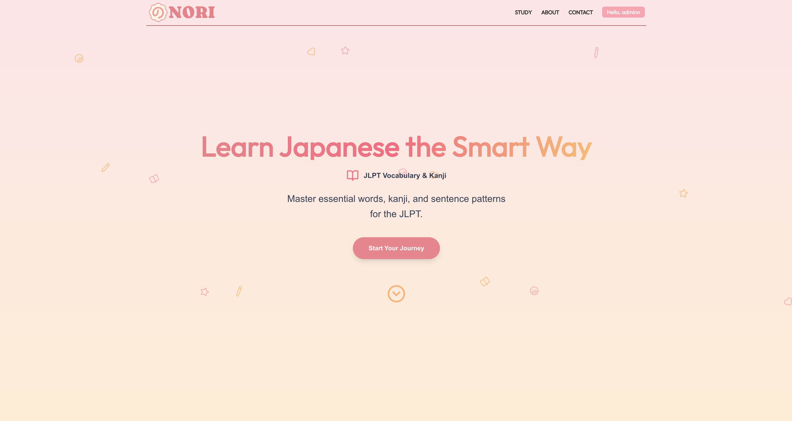
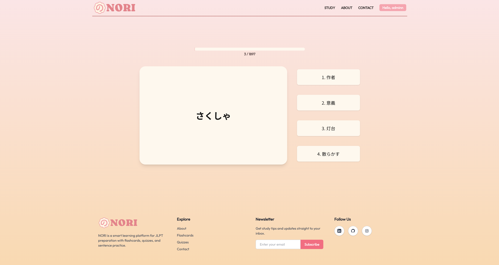
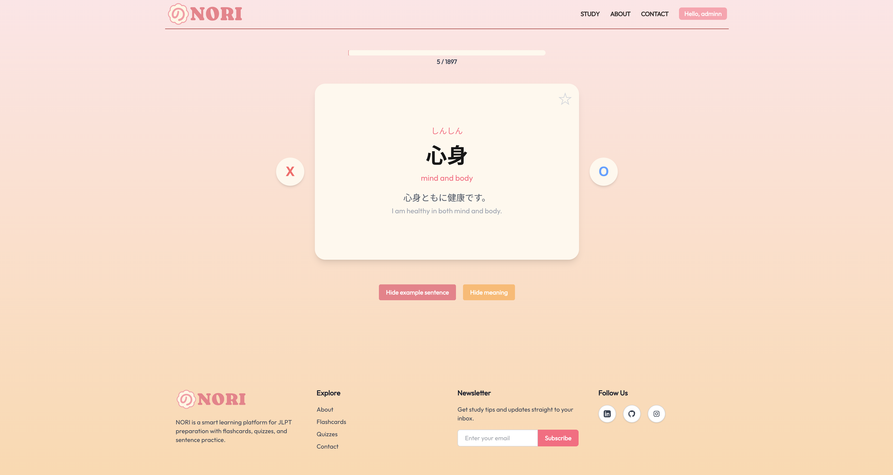
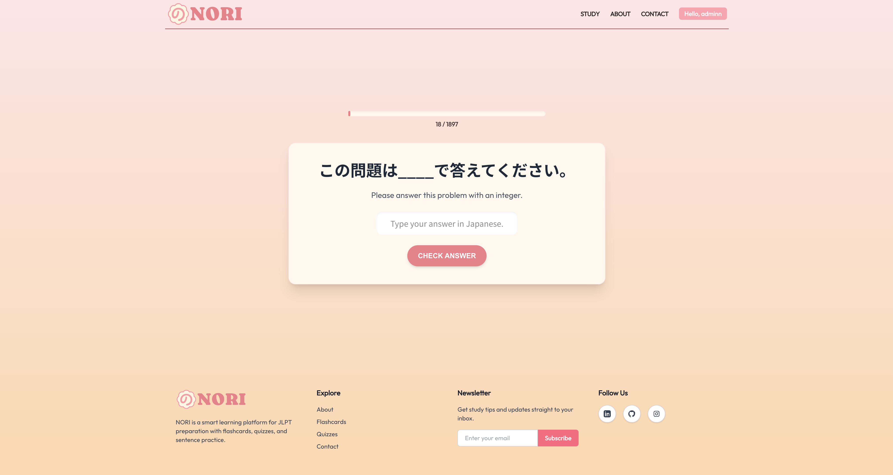

# NORI

NORI is a Japanese learning web app focused on JLPT vocabulary and kanji. It delivers bite-sized study flows (flashcards, quizzes, fill-in-the-blank) with accounts, progress tracking, and favorites to help learners build consistent momentum.

VISIT NORI! --> https://nori-z65k-lae0ay5k8-seyeons-projects-49f12252.vercel.app

## Screenshots






## What It Does

- JLPT-focused study modes: flashcards, quizzes, and fill-in-the-blank practice
- Vocabulary and kanji content organized by level (N1 to N5)
- Favorites list for quick review
- Progress tracking per mode/level and resume-able review sessions
- Email-based signup with verification and JWT cookie sessions
- Contact form for user feedback

## Main Pages

- Home landing page with study entry points
- Study selection pages for flashcards/quiz/fill-in-the-blank
- Login, signup, and email verification flows
- Account management (profile update, password change, account deletion)
- Contact page

## API Highlights

- Auth: signup with email verification, resend verification, login, logout
- Words: list words, word details, add words (for data seeding/admin)
- Progress: save study progress, reset progress, review session persistence
- Favorites: add/remove and list favorites
- Contact: send support messages via email

## Tech Stack

- Next.js 15 (App Router), React 19, TypeScript
- Tailwind CSS for styling
- Prisma ORM with MySQL
- JWT auth stored in HttpOnly cookies
- Nodemailer for verification and contact emails
- Framer Motion animations, Swiper, Recharts, Lucide icons
- Express dev server (runs alongside Next.js during `npm run dev`)

## Local Development

```bash
npm run dev
```

Other scripts:

```bash
npm run build
npm run start
npm run lint
npm run seed:words
```
